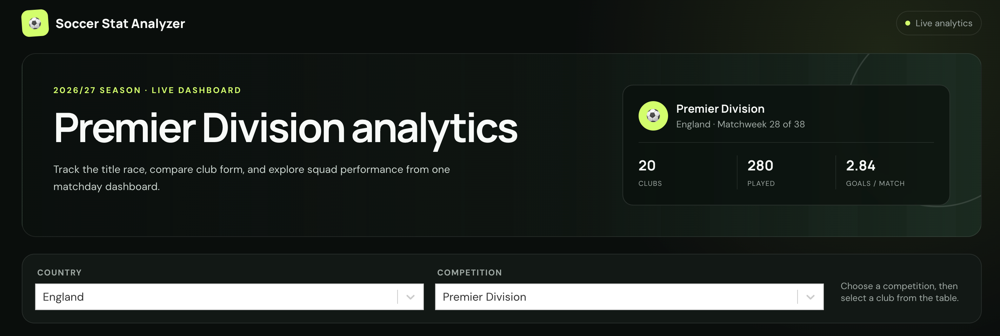
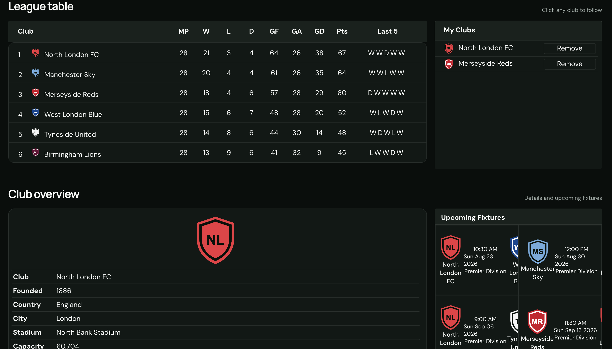
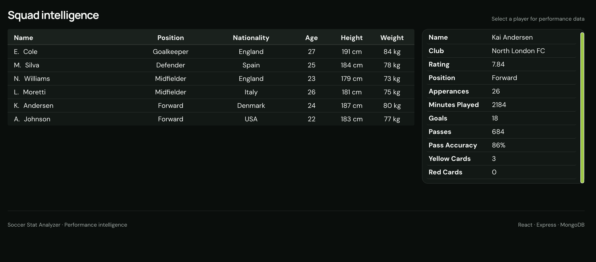

# Soccer Stat Analyzer

> A full-stack soccer intelligence dashboard for exploring league tables, comparing clubs, and inspecting fixtures and player performance.

Soccer Stat Analyzer turns football data into one focused analytics workspace. Choose a country and competition, inspect the table, save clubs to a personal shortlist, and move from club details to squad-level statistics without leaving the dashboard. A built-in demo dataset keeps the full interface presentation-ready without external services.

## Preview



### League and club analysis



### Squad intelligence



## Why this project matters

This project demonstrates an end-to-end JavaScript application: a responsive React interface, an Express API layer, MongoDB-backed caching, and integration with API-Football. The caching layer reduces repeated third-party requests and provides a foundation for rate-limit-aware data delivery.

## Product highlights

- Browse competitions by country and league
- Inspect full tables including form, goal difference, and points
- Follow and remove clubs from a focused shortlist
- Review club information and upcoming fixtures
- Explore squad profiles and individual player performance
- Cache upstream football data in MongoDB
- Responsive, keyboard-friendly dashboard UI
- Built-in demo data for local previews and portfolio screenshots

## Architecture

```text
React client  →  Express routes  →  MongoDB cache
                     ↓ (cache miss)
                API-Football
```

| Area | Technology |
| --- | --- |
| Client | React, styled-components, React Select |
| Server | Node.js, Express, Axios |
| Data | MongoDB, API-Football |
| Tooling | Webpack, Babel, ESLint |

## Run locally

### Prerequisites

- Node.js 16+
- MongoDB running locally or a MongoDB connection URI
- An API-Football key from RapidAPI

### Setup

```bash
git clone https://github.com/neupaneb/Soccer-Stats.git
cd Soccer-Stats
npm install --legacy-peer-deps
source .env.example
```

Copy `.env.example` to your preferred local environment file, replace the placeholder values, and export those variables before starting the server. Environment files are ignored by Git so credentials are not committed.

Build the client and start the server:

```bash
npm run build
npm start
```

Open [http://localhost:1337](http://localhost:1337).

For client development, run `npm run bundle` in one terminal and `npm run dev` in another.

## Engineering notes

- Express serves both the compiled React client and internal football-data routes.
- Read requests check MongoDB first; cache misses retrieve data from API-Football and persist the result.
- Third-party credentials and database configuration are supplied through environment variables.
- The UI uses reusable components for standings, fixtures, clubs, squads, and player statistics.

## Roadmap

- Migrate the historical API-Football v2 response models to the latest API version
- Add route and component tests with mocked API responses
- Persist each user's followed clubs
- Add loading, retry, and stale-data indicators
- Deploy the client, API, and managed database

## Author

Built by [Bibek Neupane](https://github.com/neupaneb).
